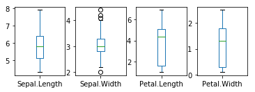
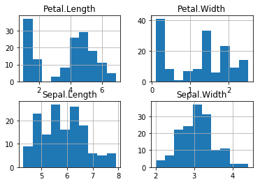
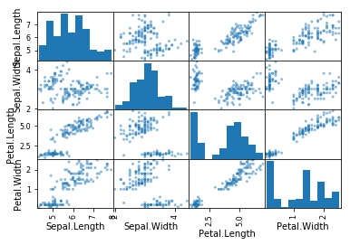

```python
import sys
print('Python: {}'.format(sys.version))

import scipy
print('scipy: {}'.format(scipy.__version__))

import numpy
print('numpy:{}'.format(numpy.__version__))

import matplotlib
print('matplotlib: {}'.format(matplotlib.__version__))

import pandas
print('pandas: {}'.format(pandas.__version__))

import sklearn
print('sklearn: {}'.format(sklearn.__version__))
```

    Python: 3.6.4 |Anaconda, Inc.| (default, Jan 16 2018, 10:22:32) [MSC v.1900 64 bit (AMD64)]
    scipy: 1.0.0
    numpy:1.14.0
    matplotlib: 2.1.2
    pandas: 0.22.0
    sklearn: 0.19.1
    


```python
#Load libaries
import pandas
from pandas.plotting import scatter_matrix
import matplotlib.pyplot as plt
from sklearn import model_selection
from sklearn.metrics import classification_report
from sklearn.metrics import confusion_matrix
from sklearn.metrics import accuracy_score
from sklearn.linear_model import LogisticRegression
from sklearn.tree import DecisionTreeClassifier
from sklearn.neighbors import KNeighborsClassifier
from sklearn.discriminant_analysis import LinearDiscriminantAnalysis
from sklearn.svm import SVC
```


```python
url ='C:/Users/Administrator/Desktop/Data sets 3 sem/iris.csv'

#names = ['Sepel-length','sepel-width','petel-length','petal-width','class']

dataset = pandas.read_csv(url)
print(dataset)
```

         Sepal.Length  Sepal.Width  Petal.Length  Petal.Width    Species
    0             5.1          3.5           1.4          0.2     setosa
    1             4.9          3.0           1.4          0.2     setosa
    2             4.7          3.2           1.3          0.2     setosa
    3             4.6          3.1           1.5          0.2     setosa
    4             5.0          3.6           1.4          0.2     setosa
    5             5.4          3.9           1.7          0.4     setosa
    6             4.6          3.4           1.4          0.3     setosa
    7             5.0          3.4           1.5          0.2     setosa
    8             4.4          2.9           1.4          0.2     setosa
    9             4.9          3.1           1.5          0.1     setosa
    10            5.4          3.7           1.5          0.2     setosa
    11            4.8          3.4           1.6          0.2     setosa
    12            4.8          3.0           1.4          0.1     setosa
    13            4.3          3.0           1.1          0.1     setosa
    14            5.8          4.0           1.2          0.2     setosa
    15            5.7          4.4           1.5          0.4     setosa
    16            5.4          3.9           1.3          0.4     setosa
    17            5.1          3.5           1.4          0.3     setosa
    18            5.7          3.8           1.7          0.3     setosa
    19            5.1          3.8           1.5          0.3     setosa
    20            5.4          3.4           1.7          0.2     setosa
    21            5.1          3.7           1.5          0.4     setosa
    22            4.6          3.6           1.0          0.2     setosa
    23            5.1          3.3           1.7          0.5     setosa
    24            4.8          3.4           1.9          0.2     setosa
    25            5.0          3.0           1.6          0.2     setosa
    26            5.0          3.4           1.6          0.4     setosa
    27            5.2          3.5           1.5          0.2     setosa
    28            5.2          3.4           1.4          0.2     setosa
    29            4.7          3.2           1.6          0.2     setosa
    ..            ...          ...           ...          ...        ...
    120           6.9          3.2           5.7          2.3  virginica
    121           5.6          2.8           4.9          2.0  virginica
    122           7.7          2.8           6.7          2.0  virginica
    123           6.3          2.7           4.9          1.8  virginica
    124           6.7          3.3           5.7          2.1  virginica
    125           7.2          3.2           6.0          1.8  virginica
    126           6.2          2.8           4.8          1.8  virginica
    127           6.1          3.0           4.9          1.8  virginica
    128           6.4          2.8           5.6          2.1  virginica
    129           7.2          3.0           5.8          1.6  virginica
    130           7.4          2.8           6.1          1.9  virginica
    131           7.9          3.8           6.4          2.0  virginica
    132           6.4          2.8           5.6          2.2  virginica
    133           6.3          2.8           5.1          1.5  virginica
    134           6.1          2.6           5.6          1.4  virginica
    135           7.7          3.0           6.1          2.3  virginica
    136           6.3          3.4           5.6          2.4  virginica
    137           6.4          3.1           5.5          1.8  virginica
    138           6.0          3.0           4.8          1.8  virginica
    139           6.9          3.1           5.4          2.1  virginica
    140           6.7          3.1           5.6          2.4  virginica
    141           6.9          3.1           5.1          2.3  virginica
    142           5.8          2.7           5.1          1.9  virginica
    143           6.8          3.2           5.9          2.3  virginica
    144           6.7          3.3           5.7          2.5  virginica
    145           6.7          3.0           5.2          2.3  virginica
    146           6.3          2.5           5.0          1.9  virginica
    147           6.5          3.0           5.2          2.0  virginica
    148           6.2          3.4           5.4          2.3  virginica
    149           5.9          3.0           5.1          1.8  virginica
    
    [150 rows x 5 columns]
    


```python
print(dataset.shape)
```

    (150, 5)
    


```python
print(dataset.head(30))
```

        Sepal.Length  Sepal.Width  Petal.Length  Petal.Width Species
    0            5.1          3.5           1.4          0.2  setosa
    1            4.9          3.0           1.4          0.2  setosa
    2            4.7          3.2           1.3          0.2  setosa
    3            4.6          3.1           1.5          0.2  setosa
    4            5.0          3.6           1.4          0.2  setosa
    5            5.4          3.9           1.7          0.4  setosa
    6            4.6          3.4           1.4          0.3  setosa
    7            5.0          3.4           1.5          0.2  setosa
    8            4.4          2.9           1.4          0.2  setosa
    9            4.9          3.1           1.5          0.1  setosa
    10           5.4          3.7           1.5          0.2  setosa
    11           4.8          3.4           1.6          0.2  setosa
    12           4.8          3.0           1.4          0.1  setosa
    13           4.3          3.0           1.1          0.1  setosa
    14           5.8          4.0           1.2          0.2  setosa
    15           5.7          4.4           1.5          0.4  setosa
    16           5.4          3.9           1.3          0.4  setosa
    17           5.1          3.5           1.4          0.3  setosa
    18           5.7          3.8           1.7          0.3  setosa
    19           5.1          3.8           1.5          0.3  setosa
    20           5.4          3.4           1.7          0.2  setosa
    21           5.1          3.7           1.5          0.4  setosa
    22           4.6          3.6           1.0          0.2  setosa
    23           5.1          3.3           1.7          0.5  setosa
    24           4.8          3.4           1.9          0.2  setosa
    25           5.0          3.0           1.6          0.2  setosa
    26           5.0          3.4           1.6          0.4  setosa
    27           5.2          3.5           1.5          0.2  setosa
    28           5.2          3.4           1.4          0.2  setosa
    29           4.7          3.2           1.6          0.2  setosa
    


```python
print(dataset.describe())
```

           Sepal.Length  Sepal.Width  Petal.Length  Petal.Width
    count    150.000000   150.000000    150.000000   150.000000
    mean       5.843333     3.057333      3.758000     1.199333
    std        0.828066     0.435866      1.765298     0.762238
    min        4.300000     2.000000      1.000000     0.100000
    25%        5.100000     2.800000      1.600000     0.300000
    50%        5.800000     3.000000      4.350000     1.300000
    75%        6.400000     3.300000      5.100000     1.800000
    max        7.900000     4.400000      6.900000     2.500000
    


```python
print(dataset.groupby('Species').size())
```

    Species
    setosa        50
    versicolor    50
    virginica     50
    dtype: int64
    


```python

dataset.plot(kind='box', subplots = True, layout=(2,4), sharex = False, sharey = False)
plt.show()
```





```python
dataset.hist()
plt.show()
```





```python
scatter_matrix(dataset)
plt.show()
```





```python
#validationdataset or training datase
array=dataset.values
x = array[:,0:4]
y = array[:,4]

validation_size =0.40
seed = 6
x_train,x_test, y_train,y_test = model_selection.train_test_split(x,y, test_size= validation_size, random_state = seed)
```


```python
seed = 6

scoring = 'accuracy'
```


```python
#spot check algorithum
models = []
models.append(('Logistic Regression', LogisticRegression()))
models.append(('Linear DiscriminantAnalysis', LinearDiscriminantAnalysis()))
models.append(('KNeighbors Classifier', KNeighborsClassifier()))
models.append(('Decision Tree Classifier', DecisionTreeClassifier()))
models.append(('Gaussian NB', GaussianNB()))
models.append(('Support Vector Machine', SVC()))

# evaluate each modelin turn

results = []
names = []
for name, model in models:
    kfold = model_selection.KFold(n_splits=10, random_state=seed)
    cv_results = model_selection.cross_val_score(model, x_train, y_train, cv=kfold, scoring=scoring)
    results.append(cv_results)
    names.append(name)
    msg = "%s: %f (%f)" % (name, cv_results.mean(),cv_results.std())
    print(msg)
    
```

    Logistic Regression: 0.933333 (0.054433)
    Linear DiscriminantAnalysis: 0.955556 (0.073703)
    KNeighbors Classifier: 0.944444 (0.074536)
    Decision Tree Classifier: 0.944444 (0.055556)
    Gaussian NB: 0.966667 (0.050918)
    Support Vector Machine: 0.955556 (0.073703)
    

    C:\Users\Administrator\Anaconda3\lib\site-packages\sklearn\discriminant_analysis.py:442: UserWarning: The priors do not sum to 1. Renormalizing
      UserWarning)
    C:\Users\Administrator\Anaconda3\lib\site-packages\sklearn\discriminant_analysis.py:442: UserWarning: The priors do not sum to 1. Renormalizing
      UserWarning)
    C:\Users\Administrator\Anaconda3\lib\site-packages\sklearn\discriminant_analysis.py:442: UserWarning: The priors do not sum to 1. Renormalizing
      UserWarning)
    C:\Users\Administrator\Anaconda3\lib\site-packages\sklearn\discriminant_analysis.py:442: UserWarning: The priors do not sum to 1. Renormalizing
      UserWarning)
    
